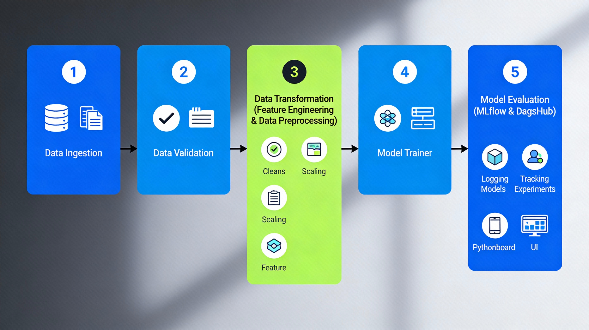
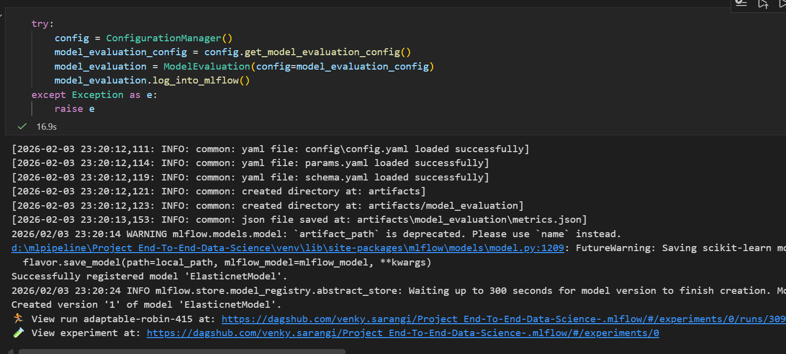
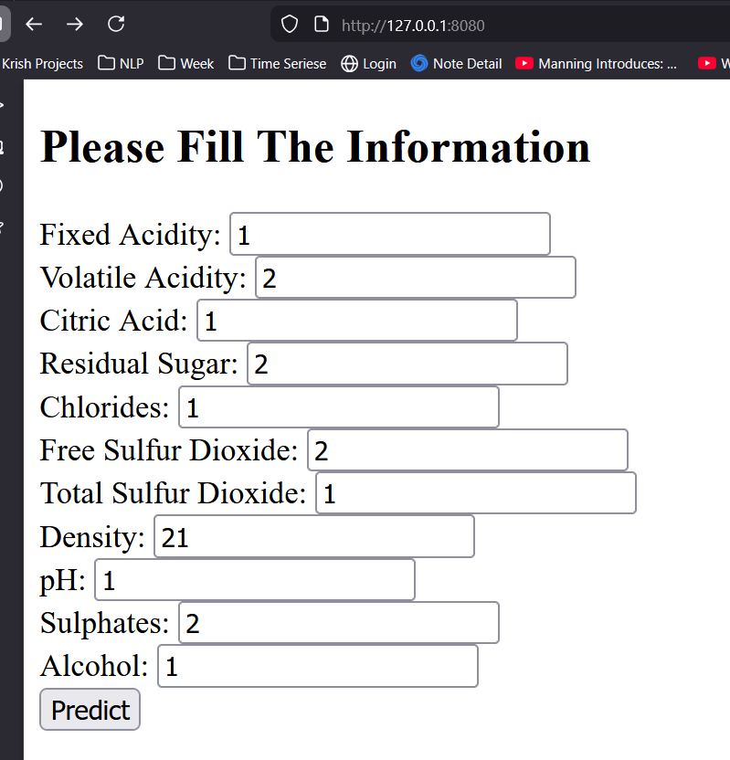
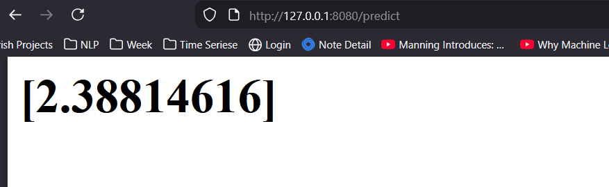
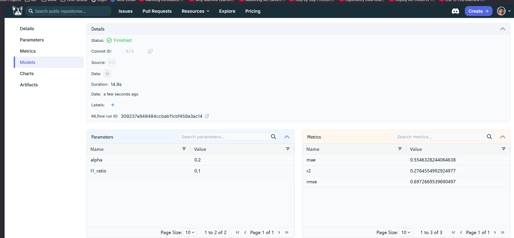
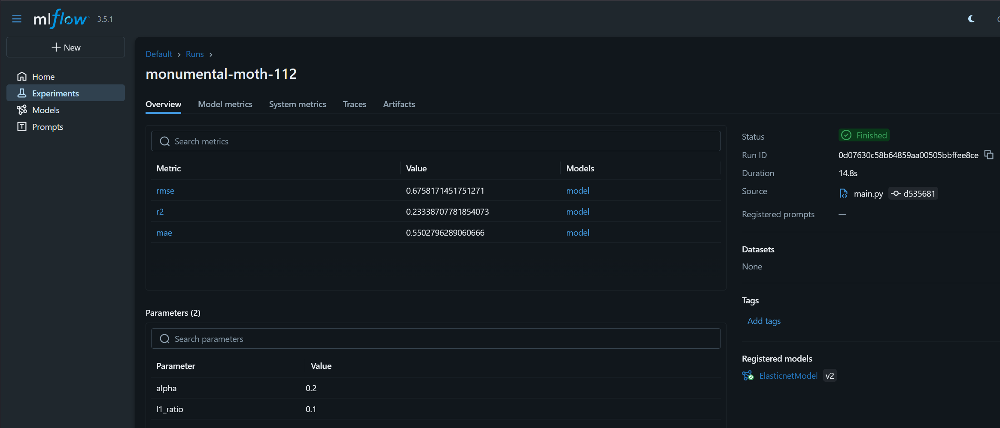

# End to End Data Science Project

### Workflows--ML Pipeline

1. Data Ingestion
2. Data Validation
3. Data Transformation-- Feature Engineering,Data Preprocessing , etc
4. Model Trainer
5. Model Evaluation- MLFLOW,Dagshub

## Workflows

1. Update config.yaml
2. Update schema.yaml
3. Update params.yaml
4. Update the entity
5. Update the configuration manager in src config
6. Update the components
7. Update the pipeline 
8. Update the main.py

## Implimentation 

1. CI/CD
2. ASW EC2 server
3. Docker deploy

--- 

  <strong> Project Pipeline </strong>

  

--- 

  <strong> Code Run </strong>

  

--- 

  <strong> Flask App Run and Inputs Data </strong>

  

--- 

  <strong> Flask App Results </strong>

  

--- 

  <strong> Dagshub : Remote Reposity </strong>

  

--- 

  <strong> MLflow : Experiments Tracking </strong>

  

--- 

